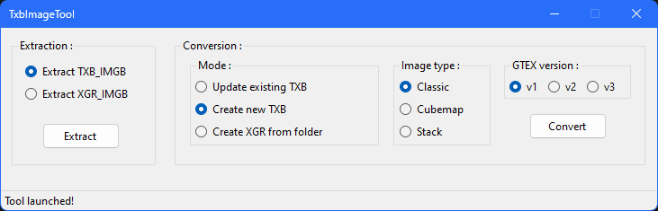

# TxbImageTool
 

This tool allows you to extract and convert image files to a valid format that is supported by the FINAL FANTASY XIII trilogy. 

Please refer to this [page](https://github.com/Surihix/TxbImageTool/blob/master/ToolUsage.md) for instructions on using this tool.
